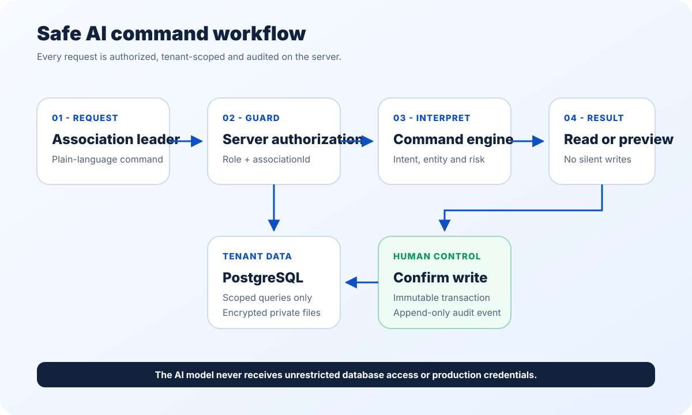

# Uyushmachi.uz - President Tech Award review build

Uyushmachi.uz is a multi-tenant SaaS operating system for transport associations. It replaces fragmented paper, spreadsheet and messaging workflows with one secure platform for vehicles, services, payments, balances, documents and role-based management.

- Live MVP: [uyushmachi.uz](https://www.uyushmachi.uz/)
- Category: Logistics and Mobility
- Stage: Working MVP

## What this public repository contains

This is a sanitized, runnable excerpt of the production command workflow. It demonstrates the security-critical path used by the AI Command Center:

1. understand a natural-language request;
2. scope every lookup to the signed-in association;
3. return read-only results immediately;
4. prepare a preview for any write action;
5. write only after explicit human confirmation;
6. append an audit event together with the transaction.

The sample intentionally contains no production credentials, customer records, private documents or database exports.

## Run it

Requirements: Node.js 20 or newer. No third-party package is required.

```bash
npm test
npm start
```

Open [http://localhost:4173](http://localhost:4173) and try:

- `Show the lease agreement for vehicle 75S375KA`
- `Open vehicles with debt`
- `Add a payment of 1 million UZS to 75S375KA`

The third command produces a preview. Only the **Confirm write** action creates a ledger entry and its matching audit event.

## Reviewer map

| File | What it proves |
| --- | --- |
| `src/command-engine.mjs` | Intent matching, tenant isolation and confirmation-gated writes |
| `src/demo-data.mjs` | Sanitized two-tenant fixture with the same plate number in both tenants |
| `src/server.mjs` | A runnable HTTP API and browser demo using only Node.js |
| `public/index.html` | Interactive English demo interface |
| `tests/command-engine.test.mjs` | Isolation, document routing, write confirmation and replay protection |

## Production architecture

The production application uses TanStack Start, React 19, PostgreSQL, Drizzle ORM, Zod, encrypted private file storage and provider-backed AI. The public review build replaces infrastructure dependencies with in-memory fixtures so reviewers can run the core safety contract in seconds.



Production roles are `super_admin`, `association_admin` and `owner`. Tenant-owned records carry an `associationId`; server-side reads and writes re-check that scope. Financial records are immutable: incorrect entries are voided instead of deleted, and critical mutations are recorded in an append-only audit log.

## Working MVP modules

- multi-association administration;
- vehicle and owner accounts;
- services, tariffs and recurring charges;
- UZS/USD payments, balances and debt visibility;
- private document storage and expiry warnings;
- Excel import with validation and rollback;
- subscription and payment-review workflows;
- finance dashboards, risk analysis, audit and backup;
- an AI Command Center for navigation, document retrieval and confirmation-gated actions.

## Scope of this submission

The current submission is the working web MVP. Border-queue intelligence and a freight exchange are roadmap items and are not represented as completed features.

## License and review use

Copyright (c) 2026 Uyushmachi.uz. All rights reserved. This repository is
provided only for technical evaluation of the President Tech Award application;
it is not an open-source release. Copying, redistribution, deployment and
derivative works are not permitted without written authorization. See
[`LICENSE.md`](LICENSE.md). No production secrets or customer data are included.
